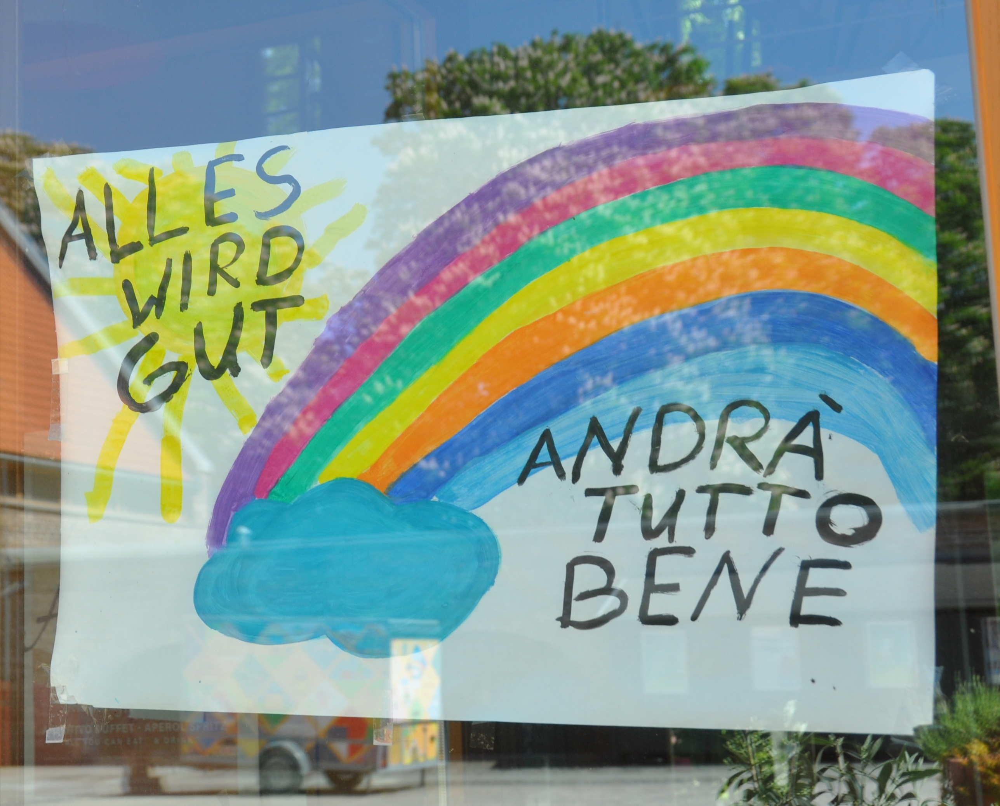
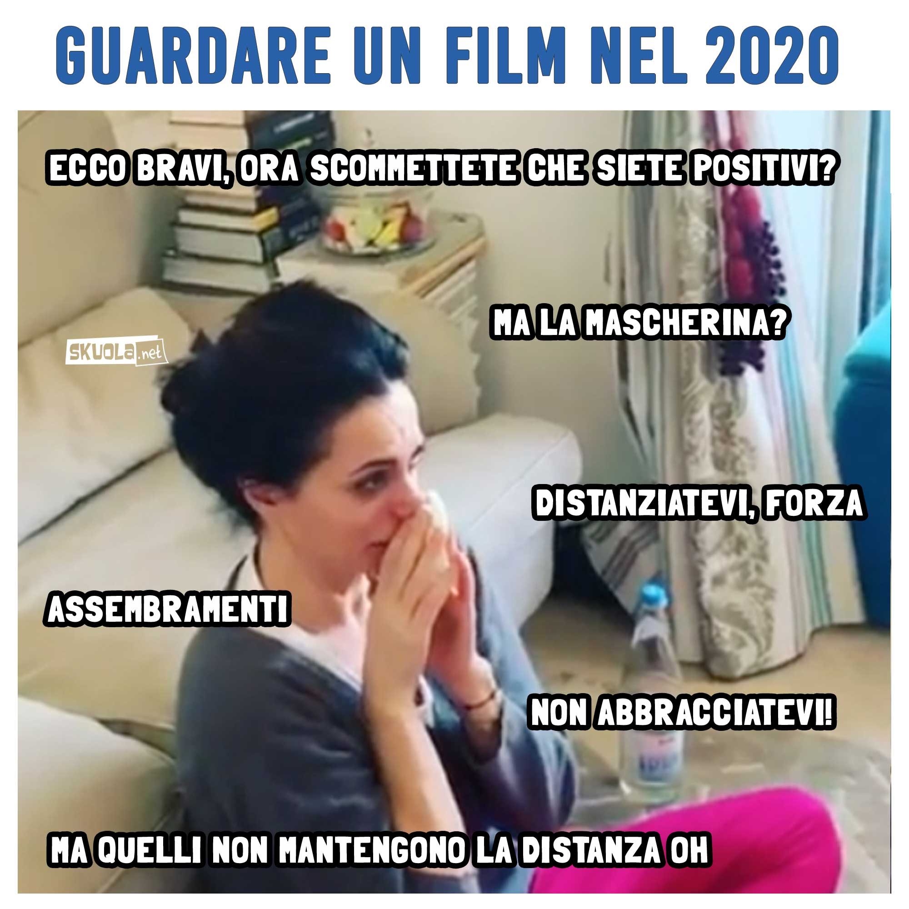
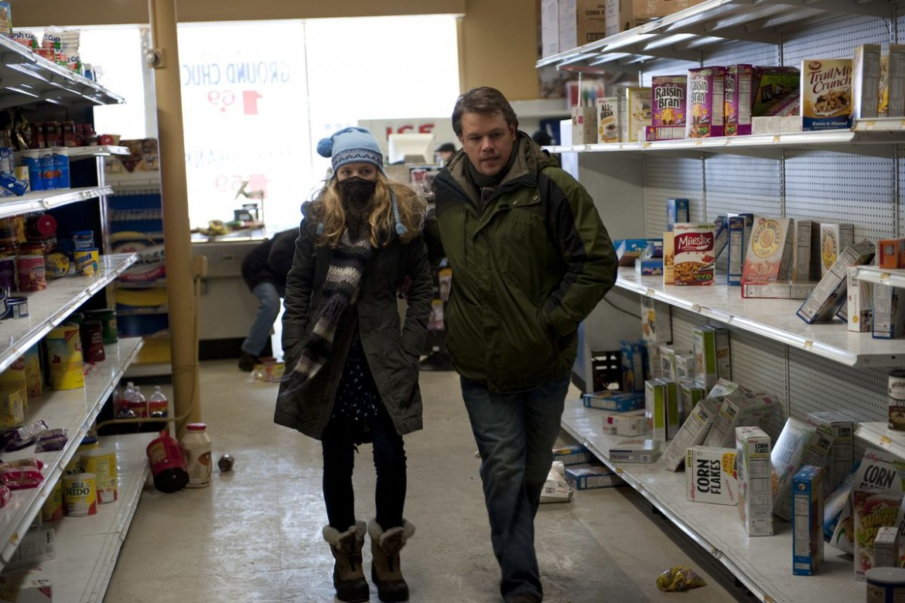

# Introduzione {.unnumbered}

Agnese Vardanega

::: {.bio}
Università degli studi di Teramo (avardanega\@unite.it)
:::

Questo ciclo di seminari è stato organizzato all'inizio della pandemia, nell'ambito del corso in *Sociologia e ricerca sociale applicata*, che generalmente dedico alla sociologia del web.

L'idea era quella di accompagnare i ragazzi in un'auto-riflessione su questa esperienza epocale, che stava sconvolgendo la quotidianità di tutti. Già nel corso rivolto agli studenti del primo anno, tenuto nella prima parte del semestre, e interrotto nella sua modalità normale, in presenza, dalla chiusura delle scuole (5 marzo 2020), avevamo fatto un po' di auto-etnografia (cfr. Jones 2007; Gariglio 2017). In molti ambiti della nostra vita, infatti, il lockdown ha reso visibile il "dato per scontato" dell'organizzazione sociale, facendo saltare quella "normalità" che lo rende invisibile.

Le questioni centrali della sociologia, che così spesso risultano astratte e lontane dall'esperienza, assumono così immediata concretezza e visibilità.

Come abbiamo risposto alla crisi? Cosa sta succedendo nelle nostre vite? Ma soprattutto: quali problemi ci si stanno ponendo? E quali risorse abbiamo --- o non abbiamo --- a disposizione per rispondervi?

Ho sentito il bisogno di riflettere su questi aspetti insieme a persone che si occupano professionalmente, a vario titolo, di innovazione, comunicazione e digitale. Tutti gli incontri sono stati preceduti da lunghe conversazioni interlocutorie sul tema da affrontare e su come affrontarlo.

Il focus, come si evince già dal titolo di questo volume, è rappresentato dalle nuove tecnologie nella vita di tutti i giorni, e sul ruolo che hanno avuto, e che stanno avendo, nel facilitare e nel cambiare le nostre vite e il nostro mondo.

```{r eval=FALSE, include=FALSE, out.width="70%"}

```

<figure>


<figcaption>

Figura 1. «Andrà tutto bene» (Nicola, [Wikimedia Commons](https://commons.wikimedia.org/wiki/File:K%C3%B6ln-Nippes_Tutto_Bene.jpg), CC-by-sa 4.0)

</figcaption>

</figure>

## Andrà tutto bene? {#andra-tutto-bene .unnumbered}

Nei nostri incontri di aprile e di maggio, eravamo poco convinti che sarebbe andato tutto bene. Quello che era certo, è che tutti volevano tornare a prima. "Andrà tutto bene", per i più significava, e significa ancora, tornare allo *status quo ante*.

Una pandemia è un "fatto sociale totale", come è stato sottolineato da molti, citando Mauss (2016; ed. or. 1924).

> un fatto sociale totale è un sistema/insieme di discorsi (retoriche, dibattiti, teorie, dichiarazioni, opinioni, slogan, ecc.) e di pratiche (azioni politiche, divieti, controlli, prescrizioni, comportamenti, precauzioni, limitazioni, ecc.) che permea ogni aspetto della vita e delle interazioni sociali (Matera 2020).

Non è possibile sottovalutare l'impatto psicologico e culturale, prima ancora che economico, del restare chiusi in casa, con contatti con l'esterno non solo ridotti al minimo, ma visti anche come potenzialmente pericolosi.

A ciò si aggiunga che il cambiamento è stato radicale ed improvviso nella vita di tutti, configurando dunque una situazione di crisi collettiva nel senso più pieno del termine.

> uno stato più o meno permanente di disorganicità, di mancanza di uniformità e corrispondenza tra valori e modi di vita ... In senso più concreto, ogni situazione, più o meno transitoria, di malessere e di disagio, che in determinati istituti, aspetti o manifestazioni della vita sociale, sia sintomo o conseguenza del maturarsi di profondi mutamenti organici o strutturali (Vocabolario Treccani, voce "Crisi"; Treccani s.d.).

Il termine *crisi* è apparentato con il termine *criterio,* dal momento che entrambi derivano dal verbo κρίνω (*crino*, giudico): una crisi rende problematico ciò che prima era dato per scontato, e necessario dunque discernere e prendere decisioni.

I meccanismi di negazione hanno avuto e continuano ad avere un ruolo importante nel mantenimento del senso. "Andrà tutto bene", "Torneremo alla normalità", sono modi per elaborare la crisi senza elaborare culturalmente il cambiamento.

Nella conversazione con **Gianluigi Tiddia**, ingegnere, esperto di turismo e di nuovi media, è molto presente la difficoltà da parte di tutti gli operatori del turismo --- fino ad arrivare ai politici --- a comprendere la portata di questa crisi ([Capitolo 3](#tiddia)). E oggi, mentre chiudo questo lavoro, a dicembre, il dibattito sulle vacanze di Natale e sulle settimane bianche replica quello di maggio-giugno sulle vacanze estive. Già questo, visto con il senno del poi, o forse senza il senno del poi, è di per sé un punto.

## Distanziamento sociale e anomia {.unnumbered}

Come è stato sin troppo spesso ricordato in questi mesi, Boccaccio, nell'*Introduzione alla giornata prima* del *Decameron*[^vardanega-1], descrive le diverse risposte individuali e collettive all'epidemia di peste del 1348. 

[^vardanega-1]: <https://it.wikisource.org/wiki/Decameron/Giornata_prima/Introduzione>.

Alcuni sceglievano il "lockdown":

> Ed erano alcuni, li quali avvisavano che il viver moderatamente ed il guardarsi da ogni superfluitá avesse molto a cosí fatto accidente resistere: e fatta lor brigata, da ogni altro separati viveano, ed in quelle case ricogliendosi e racchiudendosi dove niuno infermo fosse e da viver meglio, dilicatissimi cibi ed ottimi vini temperatissimamente usando ed ogni lussuria fuggendo, senza lasciarsi parlare ad alcuno o volere di fuori, di morte o d'infermi alcuna novella sentire, con suoni e con quegli piaceri che aver poteano si dimoravano. 

Altri, invece, ritenevano che si dovesse continuare la vita di prima, e anzi si davano ad una sorta di "movida" dissennata:

> Altri, in contraria oppinion tratti, affermavano, il bere assai ed il godere e l'andar cantando attorno e sollazzando ed il sodisfare d'ogni cosa all'appetito, che si potesse, e di ciò che avveniva ridersi e beffarsi esser medicina certissima a tanto male.

Particolarmente significativo, con riferimento al tema di questo ciclo di seminari, è il brano in cui Boccaccio mette in rapporto l'esperienza della fame e della morte con la perdita di senso e la dissolutezza dei costumi:

> per le sparte ville e per li campi i lavoratori miseri e poveri e le loro famiglie, senza alcuna fatica di medico o aiuto di servidore, per le vie e per li loro cólti e per le case, di dí e di notte indifferentemente, non come uomini ma quasi come bestie morieno. Per la qual cosa essi cosí nelli loro costumi come i cittadini divenuti lascivi, di niuna lor cosa o faccenda curavano: anzi tutti, quasi quel giorno nel quale si vedevano esser venuti la morte aspettassero, non d'aiutare i futuri frutti delle bestie e delle terre e delle loro passate fatiche, ma di consumare quegli che si trovavano presenti si sforzavano con ogni ingegno.

Per evitare tanto la morte, quanto la "dissoluzione morale", il venir meno del legame sociale e *dunque* della progettualità esistenziale[^vardanega-2], Boccaccio fa suggerire a Pampinea l'allontanamento dalla città e il ritiro in campagna, accompagnato però da una attività ad un tempo sociale, ludica e creativa: il racconto delle novelle.

[^vardanega-2]: «Dissolto e dissoluto risalgono alla stessa forma latina dissolutum, participio passato del verbo dissolvere, verbo composto sulla base di solvere ... Accanto al significato generico di 'sciogliere' già il latino quindi prevedeva anche quelli di 'slegare, sciogliere da vincoli', derivanti dalla forma primaria luere (che con il prefisso se aveva dato seluere da cui solvere) dal quale aveva ereditato le accezioni di 'liberarsi da regole, da leggi stabilite e fisse' (da luere in italiano abbiamo anche lussare, lusso e lussuria). Il participio passato dissolutum, nella sua funzione aggettivale, indicava quindi anche ciò che è 'libero da leggi' e, accanto a questo significato coesisteva, come naturale conseguenza, quello di 'impunito, licenzioso'» (Accademia della Crusca, <https://accademiadellacrusca.it/it/consulenza/dissoluto-e-dissolto/727>).

Secondo Boccaccio, insomma, quella che oggi chiameremmo "anomia", la perdita cioè del riferimento a norme e ruoli consolidati, si contrasta con la relazione e la socialità, ma secondo modalità e forme *necessariamente "innovative"* rispetto a quelle in uso nei tempi precedenti[^vardanega-3].

[^vardanega-3]: Lebaron (2020) parla di anomia anche per quanto riguarda le relazioni internazionali.

La nostra generazione ha dovuto affrontare la pandemia come si è sempre fatto, ovvero chiudendosi in casa, ma avendo la possibilità di restare in contatto, di comunicare con familiari, partner e amici, e condividere attività ludiche e produttive a distanza. E questo ha in parte ammortizzato l'onda d'urto di questo "fatto totale" sulla nostra vita quotidiana.

Se in questi mesi l'incombere sulle nostre vite di quello che a gennaio era il "misterioso virus cinese" ha dato la stura a tante forme di negazione della realtà e all'irresistibile tentazione di credere a qualunque notizia o dichiarazione rassicurante, mentre la perdita del lavoro gettava tanti nella disperazione, è pur vero che molte attività sociali ed economiche sono continuate, bene o male, a distanza.

Questi stessi incontri, ad esempio, probabilmente non si sarebbero mai svolti in presenza, per problemi logistici e di tempo. Le attività di ufficio e quelle della pubblica amministrazione sono andate avanti. Se il commercio di quartiere ha sofferto per le chiusure, solo in alcune circostanze riorganizzandosi per la vendita a distanza (cfr. qui, Napolitano, [primo capitolo](#napo "primo capitolo")), la catena della produzione ha certamente tamponato il crollo della domanda grazie all'e-commerce.

Al di là dei vantaggi economici, la possibilità di mantenere parte delle relazioni e parte delle attività ha ridotto gli effetti della "dissoluzione" sociale, che riecheggiava in qualche misura nel dibattito su "distanza sociale" vs. "distanza fisica". 

In sociologia e psicologia sociale, l'espressione *distanza sociale* ha una storia e un significato ben precisi, è vero. Nello stesso tempo, però, le analisi di Goffman (1956; 1972; 1983) sulle modalità attraverso le quali la distanza sociale è elaborata culturalmente lasciano ben intuire che, per mantenere in pubblico una distanza fisica evitando che questa diventi *sociale*, bisogna inevitabilmente elaborarne di nuove. 

Un metro è una distanza fisica enorme, in prossemica, del tutto innaturale fra persone che si conoscono. Quanti di noi si sono sentiti a disagio nel non dover/voler dare la mano a un conoscente incontrato per strada? O nel tenersi alla larga dagli altri fra gli scaffali del supermercato, aspettando pazientemente il proprio turno per avvicinarsi ai prodotti? Nel mettere in atto insomma misure di distanziamento sociale, di evitamento, le stesse che terremmo nei confronti di untori o appestati, e che vengono non di rado tenute --- magari inconsapevolmente --- nei confronti di gruppi o persone stigmatizzate come "sporche" (i senzatetto, le prostitute ecc.).

Per neutralizzare l'impressione di voler tenere una distanza sociale da questi sconosciuti, abbiamo magari iniziato a sorridere da dietro la mascherina, siamo stati più amichevoli del solito, forse in questo più solidali. Sorrisi e gesti che in altre circostanze sembrerebbero eccessivi o invadenti, e che oggi servono a rassicurare ("non ti vedo come un pericolo"). D'altra parte, ci sentiamo facilmente "invasi" da chi si avvicina o non coopera nel mantenere le distanze, e, nello stesso tempo, a disagio per essere tenuti a distanza.

Nella pausa estiva, abbiamo poi sperimentato quella che Romania (2020), in riferimento alla fine della pandemia e al ritorno alla normalità, ha chiamato "anomia interazionale": E adesso che si fa? Che comportamento dobbiamo tenere in pubblico? Saremo apprezzate/i o stigmatizzate/i per portare/non portare la mascherina, o per avvicinarci/non avvicinarci agli altri?

```{r eval=FALSE, include=FALSE, out.width="70%"}

```

<figure>


<figcaption>

Figura 2. L'anomia interazionale secondo «Skuola.net» (da: <https://www.facebook.com/skuola.net>)

</figcaption>

</figure>

## Nuove tecnologie e nuove forme di socialità {#nuove-tecnologie-socialita .unnumbered}

Purtroppo, la distanza fisica ha, a mio avviso, un inevitabile effetto sociale, anche se sperabilmente non quello a cui fanno riferimento Bogardus (1947) e Goffman. Tentare di "neutralizzare" questo effetto parlando di distanza "meramente" fisica è illusorio, e potrebbe persino condurre a sottovalutare il potenziale effetto anomico delle misure di distanziamento.

Il fantasma della regressione all'orda --- così spesso rappresentato nei film apocalittici, come Contagion (Soderbergh 2011) --- è un orizzonte di possibilità che fa paura, tanto quanto la morte e la malattia, e forse anche di più. E resta quindi sottaciuto, negato, rimosso.

<figure>



<figcaption>

Figura 3. Dal film *Contagion*: Il protagonista con la figlia in un supermercato saccheggiato.

</figcaption>

</figure>

Nondimeno, il riferimento alle nuove tecnologie e alle nuove forme di socialità non voleva e non vuole essere qui consolatorio o rassicurante. Come diceva Clay Shirky, nella sua conversazione con Daniel Goleman (2015):

> il *social software* non è meglio del contatto personale diretto, è solo meglio di niente. 

E sì che Shirky è un ottimista del web, per di più specializzato nella costruzione e nella gestione di social software (*communities*) per le grandi aziende. Non è insomma un "apocalittico", come Morozov, per citare il più noto.

Dovrebbe dunque indurre a riflettere anche i più ottimisti che sia proprio Shirky a sottolineare come le relazioni mediate siano meno efficienti e produttive, in quanto prive della componente emozionale, e dunque sociale, di quelle faccia-a-faccia:

> se sei in trattative commerciali per un codice sorgente apprezzi veramente un genere di ambiente asincrono e fortemente logico. Ma se stai cercando di portare un gruppo a prendere una decisione che non deve essere concordata solo su un piano razionale ma anche approvata con partecipazione emozionale --- un nuovo business, una nuova e rischiosa impresa, vuoi fisicamente vuoi intellettivamente --- quello che gli strumenti di Internet ti aiuteranno a fare è stilare un elenco ragionato dei pro e dei contro, ma non aiuteranno te e il gruppo a raggiungere il nucleo di un accordo emotivamente condiviso.

Questo tema viene ampiamente discusso nell'intervento di **Paolo Subioli**, esperto di marketing digitale e blogger ([Capitolo 2](#subioli)), ed è forse la ragion d'essere del suo libro che ho suggerito come lettura agli studenti --- *Ama il tuo smartphone come te stesso* (Subioli 2018).

Il disagio e la fatica delle riunioni online, la stanchezza e il disorientamento provocati dalle discussioni sui social, e infine la mancanza delle relazioni in presenza, rappresentano tutte occasioni per osservare e soprattutto vivere diversamente l'esperienza dell'online. Una esperienza che, in realtà, è ancorata ad un corpo, a una mente che è *anche* (forse principalmente) emotiva e sociale, e a un luogo fisico --- ad uno spazio-tempo, che sia quello della postazione di lavoro o quello estemporaneo in cui interagiamo attraverso i social. «La nostra mente si crea di continuo --- scrive Subioli --- ricomponendosi di volta in volta in un rapporto di collaborazione tra cervello, corpo e ambiente».

L'online non è "virtuale", è reale ed ha effetti sulla vita reale (Subioli parla di *karma digitale*). Su questo punto, ed in particolare sulle conseguenze di quello che si dice/fa in rete, e del linguaggio che si usa, è intervenuto anche Gianluigi Tiddia ([§3.9](#cap3-09)), che ha raccontato l'esperienza di "Parole O_Stili" ([paroleostili.it](https://paroleostili.it/){.uri}), una iniziativa nata in rete, dalla collaborazione spontanea di persone che hanno sentito/individuato un bisogno reale (la «deriva violenta e poco umana che stava prendendo la rete», racconta Tiddia), e a cui hanno dato una risposta "reale", che ha trovato un suo mercato, creando dunque "valore" economico altrettanto "reale".

È vero che, come dice Morozov, «da vent'anni non nasce una nuova Wikipedia» (2020; cfr. anche 2014), ma è anche vero che tante iniziative piccole e meno piccole mostrano la persistente capacità della rete di facilitare attività civiche di rilevanza sociale, culturale e anche economica, a partire dal contributo volontario e dall'*expertise* delle persone[^vardanega-4].

[^vardanega-4]: Questo desiderio di partecipare e produrre per il piacere di farlo richiama immediatamente --- ovvero senza arrivare a Hannah Arendt o agli scritti giovanili di Marx --- l'*homo artifex* di Sennett (2017), e tanto più se riferito alla dimensione civica e all'abitare i territori (Sennett 2018).

La cultura del *civic hacking* è il tema dell'intervento di **Maurizio Napolitano**, coordinatore dell'unità Digital Commons Lab della Fondazione Bruno Kessler, che ha presentato alcune fra le tante esperienze realizzate nel corso della prima ondata: da Wuhan2020, all'apertura dei dati della Protezione Civile sulla spinta dell'associazione *Ondata*, ai servizi di consegna a domicilio basati su OpenStreetMap, fino al paese online di San Virtuale (nella provincia autonoma di Bolzano, per così dire), messo su per ricreare alcune condizioni di socialità nel periodo del lockdown ([Capitolo 1](#napo "Capitolo 1")).

Se le cose per noi sono andate (direi) molto meglio rispetto a come andarono ai tempi di Boccaccio, è stato *anche* grazie alle nuove tecnologie, che sono --- per l'appunto --- "meglio di niente" nel facilitare relazioni ed attività.

## La comunicazione dei dati {.unnumbered}

Nell'organizzazione e nella gestione della risposta sanitaria e politica alla pandemia, un ruolo fondamentale --- onnipervasivo --- è stato svolto dai dati, e soprattutto dalla *comunicazione dei dati*, a partire dalle conferenze stampa della Protezione Civile, fino ai bollettini regionali e talora locali di contagi, decessi e guarigioni.

Se da una parte dati e grafici rendono asettica la tragica conta delle vittime, o distolgono l'attenzione da essa con colori accattivanti e modelli astrusi, dall'altra paura e polemiche sono intrinsecamente drammaturgiche: fanno ascolto, "incollano" alla pagina web o al programma televisivo (il *problem frame*; cfr. Altheide 1995 e 1997). In questa situazione, quindi, i meccanismi narrativi e le logiche mediatiche sono entrati più che mai in conflitto con la possibilità di una comunicazione d'emergenza efficace, secondo i criteri che **Antonella Tollis**, responsabile Ufficio informazione e social media della Regione Abruzzo, illustra nel suo intervento ([§4.3](#cap4-3)).

Il [capitolo 4](#tollis) è dedicato ad analizzare i problemi incontrati dallo staff della Regione di fronte ad una comunicazione governativa basata su dati che ha imposto l'agenda ai media (lei la chiama *dittatura computazionale*), ed illustrare le strategie adottate per rispondere alle domande dei cittadini non meno che ai vari *flames* che i "numeri" producevano sui social. Da sottolineare come lo staff sia andato a cercare attivamente domande e dubbi dei cittadini, ed abbia usato i social per rispondere, dando vita ad una rubrica che ha avuto un buon seguito su YouTube, ed è stata ripresa spesso dalle testate giornalistiche regionali ([§4.5](#cap4-5)). Il tutto, naturalmente, lavorando da remoto.

Anche il giornalismo italiano non sembra essersi dimostrato all'altezza della gestione di questo tipo di informazione basata sui dati. Alcune testate giornalistiche hanno cercato di fare un po' di chiarezza sui dati messi a disposizione dalla protezione civile (si vedano ad esempio Sky TG24 2020; o lo stesso Borrelli intervistato da Repubblica, in Zunino 2020). Ma, se non ci fossero stati i volenterosi *civic hackers* di Ondata, i dati non avrebbero potuto essere oggetto di discussione pubblica del tutto, semplicemente perché per diversi giorni non sono stati diffusi in formato aperto (sulla vicenda, si vedano Saporiti 2020; Associazione Ondata 2020; e qui, Napolitano, [§1.3.2](#il-contributo-del-civic-hacking-alla-liberazione-dei-dati-della-protezione-civile "Il contributo del civic hacking alla liberazione dei dati").).

**Pina Manente**, giornalista e responsabile dell'Ufficio Stampa della Provincia di Teramo, nel [capitolo 5](#manente "capitolo 5"), mette in evidenza il rapporto che c'è fra la crisi del giornalismo d'inchiesta e la difficoltà, in generale, a fare *data journalism*. Ma in Italia è anche difficile trovare i dati, e nelle redazioni mancano spesso le competenze statistiche e informatiche per elaborarli, analizzarli ed usarli per condurre inchieste.

Le polemiche non aiutano, ma è comunque preferibile che la discussione resti pubblica, e non venga depoliticizzata a favore delle dashboard. In questo, il giornalismo potrebbe e dovrebbe dare un contributo fondamentale. Che l'attenzione pubblica nei confronti dei dati vista in questa occasione sia considerata un bene o un male ai fini della gestione dell'emergenza, resta il fatto che quello nel campo del *data journalism* è uno dei ritardi culturali maggiormente balzati all'evidenza in questo periodo.

## Ringraziamenti {.unnumbered}

Ringrazio in primo luogo gli amici, i colleghi gli studenti e tutti coloro che hanno partecipato ai seminari, per le riflessioni e le esperienze che hanno voluto condividere, e per le domande che hanno posto.

Agli autori va un ringraziamento speciale per la disponibilità a scrivere e a rendere liberamente disponibili i loro contributi, a rivederli e correggerli in prima persona, dando un apporto fondamentale anche alla realizzazione di questo prodotto, che, anche per questa ragione, viene pubblicato con licenza Creative Commons e distribuito gratuitamente in formato elettronico.

Ringrazio infine l'Università degli Studi di Teramo per avere ospitato i seminari; la dr.ssa Monia Alessandrini dell'Ufficio Comunicazione di Ateneo per l'organizzazione; e la dr.ssa Lucia Fiore, dell'Ufficio stampa e produzioni radiotelevisive, per la realizzazione della locandina, ripresa in copertina.

------------------------------------------------------------------------

Cita come:

Vardanega A. (2020). Introduzione. In A. Vardanega (a c. di), *Emergenza Covid-19. Nuove tecnologie e nuove forme di socialità*. Teramo. 2020.
