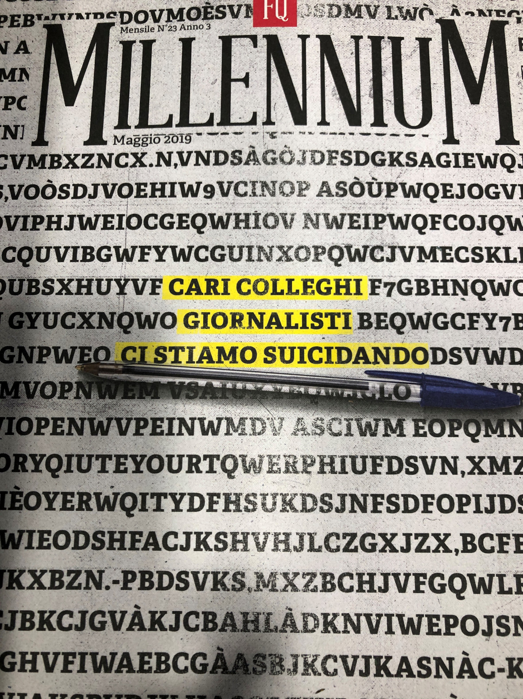
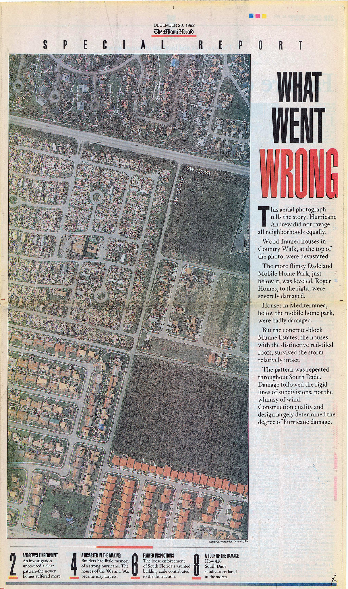
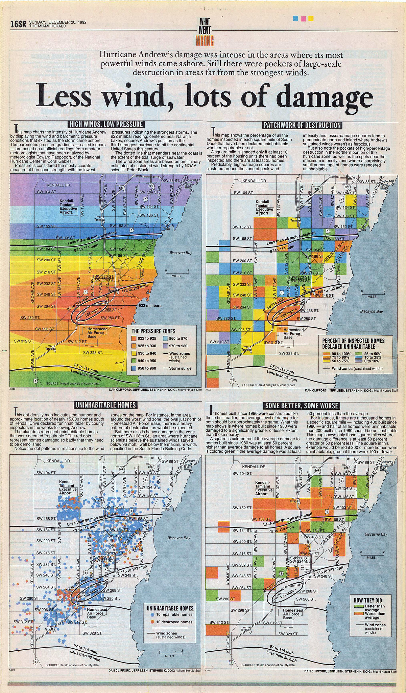

# Data Journalism e emergenza, fra editoria tradizionale (in crisi) e manipolazione dei fatti {#manente}

Pina Manente

::: {.bio}
Giornalista, e responsabile dell'Ufficio Stampa della Provincia di Teramo (manentestampa\@gmail.com).
:::

> Dov'è la saggezza che abbiamo perduto nella conoscenza?<br/>Dov'è la conoscenza che abbiamo perduto nell'informazione?<br/> T.S. Eliott

## Il giornalismo è un mestiere che si sta estinguendo? {#giornalismo-mestiere}

A maggio 2019 il mensile del Fatto Quotidiano, *Millenium*, pubblica una copertina che, con un bel gioco grafico, usa le parole come un disegno e al centro della pagina evidenzia questo titolo *Cari colleghi ci stiamo suicidando*[^manente-1].

[^manente-1]: <https://www.fqmillennium.it/edizione/cari-colleghi-ci-stiamo-suicidando>

Editori che pubblicano i giornali non per guadagnarci, ma per fare altri affari. Quotidiani quasi tutti uguali, senza notizie e schiavi delle opinioni, che mettono in pagina le loro bufale mentre denunciano le fake news della rete. Penne sporche sempre riabilitate. Questi i motivi, secondo i giornalisti della redazione di Millenium, per i quali **"**la gente non crede più a stampa e tv".

```{r eval=FALSE, include=FALSE, out.width="250pt"}

```

<figure>


<figcaption>

Figura 1. «Cari colleghi ci stiamo suicidando»

</figcaption>

</figure>

Una fragilità, questa del sistema dell'informazione, che è andata crescendo di pari passo con le tecnologie digitali e della disintermediazione nel processo di trasmissione delle informazioni. Non c'è più solo il giornalista al centro di questo processo ma "bot" -- programmi che catturano e assemblano informazioni attraverso programmi informatici -- algoritmi, che ci profilano e decidono cosa dobbiamo leggere e, si potrebbe pensare, chiunque possegga un cellulare e una tastiera.

Siamo dunque al *citizen journalism* che in tanti, da WikiLeaks in poi, hanno invocato come la strada verso un'informazione libera? Un'informazione che arriva dal basso senza condizionamenti di editori, politica, finanza? Non proprio. Anzi niente affatto.

Nel primo trimestre del 2019 solo Facebook ha disattivato circa 583 milioni di profili falsi e 837 milioni di contenuti spam. Sempre nello stesso periodo sono stati rimossi dal social network di Mark Zuckerberg 1,9 milioni di contenuti legati alla propaganda terroristica dell'Isis e gruppi affiliati[^manente-2]. Tutta informazione apparentemente "dal basso", ma costruita su misura "dall'alto" con cabine di regia ipertecnologiche in grado di fabbricare notizie e renderle virali: politica, finanza, terrorismo, marketing commerciale.

[^manente-2]: Fonte: [Facebook Newsroom](https://about.fb.com/news/).

Qualsiasi malintenzionato con un buon budget e qualche esperto informatico può diventare molto pericoloso per chiunque; rovinare la reputazione di singole persone o mettere in crisi organizzazioni complesse come aziende multinazionali o Stati. E la perdita di reputazione del giornalismo non è estranea ad accurate campagne di denigrazione costruite ad arte. A fare il resto sono stati la crisi dell'editoria, che non ha saputo affrontare le grandi trasformazioni tecnologiche e ha dimezzato introiti pubblicitari e vendite, e la precarizzazione del lavoro giornalistico. In Italia a fronte di 15.000 dipendenti con contratto giornalistico sono ben cinquantamila i lavoratori "autonomi". E nell'informazione, la parola "autonomi" perde il suo significato originario perché nessuno può garantire autonomia e qualità dell'informazione a 5 euro al pezzo! Hanno un alto valore simbolico e sostanziale gli insistenti richiami del Presidente della Repubblica, supremo garante della Costituzione, che è intervenuto molte volte per riaffermare il valore fondante dell'articolo 21 quale baluardo della democrazia rappresentativa.

In questo scenario di crisi sistemica, pochi mesi dopo l'inchiesta di Millenium, entra in scena il COVID 19. Dal 21 febbraio del 2020 l'appuntamento più seguito dagli italiani è stata la conferenza stampa della Protezione Civile trasmessa a reti -- tradizionali e social -- unificate. E l'opinione pubblica di massa, per la prima volta, si è trovata di fronte ad una mole enorme di dati, cifre, numeri da interpretare, valutare, digerire. Anche per molti giornalisti è stata una prima volta.

Oltre alle storie, tragiche, dei contagi, dei morti, della chiusura totale di interi Paesi, tutti i giorni bisognava fare i conti con dati, cifre e numeri non "storicizzati" anche questi interpretabili sulla base di indicatori variabili. Per non parlare delle divisioni del mondo scientifico; delle tesi, spesso completamente opposte di virologi ed epidemiologi e delle posizioni, divergenti, assunte nei diversi Paesi e all'interno di un Paese, leggi l'Italia, fra una Regione e l'altra.

Porgere il microfono, restituire, seppur in maniera assolutamente fedele, le dichiarazioni ora dell'uno ora dell'altro, non solo non ha risposto alla necessità di trasparenza e chiarezza ma ha alimentato l'infodemia[^manente-3]: una tale sovrabbondanza di informazioni che ha fatto sì che nessuna notizia sembrasse affidabile. E quella che, almeno in Italia, era una nicchia riservata a pochi intrepidi è diventata una specializzazione preziosa.

[^manente-3]: Cfr. Nota n. 1 nel capitolo precedente.

## Il data journalism

Nel 1921 Charles Prestwich Scott, storico giornalista britannico scriveva "I fatti sono sacri, le opinioni sono libere". A lui si fa risalire il primo saggio sul *data journalism*, ovvero sul giornalismo basato su dati verificati e verificabili. Qual è la differenza con il giornalismo tradizionale visto che in ogni caso il mestiere del giornalista è quello di rappresentare la realtà osservata? Nel metodo. Nel *data journalism* i fatti non vengono solo osservati e raccontati con gli strumenti che formazione e deontologia impongono. I fatti vengono indagati con un metodo scientifico, raccogliendo elementi verificabili analizzandoli, confrontandoli. È «il racconto del mondo che ci circonda con l'aiuto dei numeri», come si legge sul sito datajournalism.it[^manente-4], così come di grafici, tabelle, mappe, *timeline* ecc, informazione supportata da dati. La linea pare sottile ma non lo è affatto.

[^manente-4]: <http://www.datajournalism.it/cose-datajournalism-it/>

I dati vanno trattati come qualsiasi altra fonte: hanno delle gerarchie e la verifica va fatta con esperti di numerosi settori. L'approfondimento è dovuto e molto rigoroso. È molto ingenuo pensare che "i dati parlano da soli". Ogni dato ha dietro la sua storia, occorre conoscere gli indicatori posti alle base. Inserito in un contesto sbagliato lo stesso "dato" può servire a distorcere la rappresentazione dei fatti, invece che a supportarla.

A dare spazio al *data journalism* è stato per primo il mondo anglosassone, con solide radici nel giornalismo d'inchiesta: troviamo le inglesi *The Guardian* e BBC, l'australiana ABC, la società svizzera *Zeit Online*, le americane *New York Times*, *Washington Post*, *Pro Publica* e *Five Thirty Eight*. e l'argentina *La Nación*.

Tra le realtà italiane, arrivate solo di recente anche per gli oggettivi ritardi del Paese rispetto al digitale e soprattutto per un deficit di apertura dei dati di interesse pubblico, vanno citati *Wired*, *Formica Blu*, *Il Sole 24 Ore*, il *Dataroom* di Milena Gabanelli (Corriere della Sera), l'*AGI - Agenzia Italia*. Esistono poi portali e magazine online dedicati ai temi e agli strumenti del *data journalism*, quali *Data Ninja* ([dataninja.it](http://dataninja.it/){.uri}), e *DataJournalism.it* ([www.datajournalism.it](http://www.datajournalism.it/){.uri}).

### Trovare i dati

La fatica maggiore sta proprio nel trovare ed estrarre dati, soprattutto in Italia. Un Paese dove la cultura della trasparenza fa fatica a farsi strada e dove, in piena emergenza Covid, fra le prime disposizioni dei famosi DPCM del Presidente del Consiglio Conte c'è stata proprio la sospensione del FOIA: l'accesso civico generalizzato che garantisce a chiunque il diritto di chiedere dati e documenti posseduti dalle pubbliche amministrazioni. Bisogna sottolineare che anche prima del Covid le cose non andavano molto bene e sono davvero poche le amministrazioni pubbliche che fanno *open data*.

La prima condizione per poter esercitare un giornalismo d'indagine, infatti, è avere a disposizione dati in formato "aperto", e/o riutilizzabile.

Esemplare l'episodio raccontato al Corriere della Sera da Davide Mancino, collaboratore di Datajournalism.it di Wired

> la maggior difficoltà del lavoro di *data journalist* sta proprio nell'estrarre i dati, a volte può richiedere settimane. Anni fa stavo lavorando su un'inchiesta riguardante la vendita di armi italiane alla Siria. Chiesi all'ufficio stampa del ministro della Difesa se potesse mandarmi la relazione che ogni anno viene fatta proprio su questo aspetto. L'ufficio stampa mi disse che la relazione era scannerizzata e che era talmente grande (seimila pagine) che non potevano mandarmela via posta elettronica e quindi me la spedirono con un corriere (De Cesco 2015).

I dati, quindi, sono la base di partenza e il setaccio finale attraverso il quale passare le storie. Una cartina al tornasole rispetto al racconto dei testimoni, alle opinioni espresse da parti opposte, alla sensibilità e alla professionalità dello stesso giornalista. Un lavoro d'inchiesta che, naturalmente, costa molto di più, in tutti sensi --- tempo e denaro --- del porgere il microfono.

È anche per questo che nell'epoca dell'informazione *all-news* e dell'*infotainment*, in Italia gli editori ci hanno investito poco. Un articolo, un servizio o un'inchiesta realizzata seguendo questo metodo non può essere pagata cinque euro, ovvero il prezzo medio pagato per articolo ai precari. Piuttosto non si realizza. E non stiamo parlando dei diritti dei giornalisti ma di un danno alla democrazia perché un giornalismo *data-driven* può offrire nuovi livelli di informazione aiutando i cittadini, i manager, i politici a capire i contesti e a prendere decisioni basate sulle evidenze e non sul sentiment (che tanto piace a chi usa i social per manipolare fatti e informazioni).

### Un caso di scuola: «What Went Wrong?»

Stephen K. Doig non avrebbe mai potuto scrivere "What Went Wrong" (Premio Pulitzer in Servizio Pubblico nel 1993) senza utilizzare i metodi del giornalismo scientifico, e gli americani non avrebbero mai saputo che la maggior parte dei danni rilevati dopo l'uragano Andrew, nel 1992, era responsabilità dell'uomo.

```{r eval=FALSE, include=FALSE, out.width="300pt"}

```

<figure>


<figcaption>

Figura 2. "What Went Wrong". Immagine tratta dalla raccolta Flickr di Daniel X. O'Neil, <https://www.flickr.com/photos/juggernautco/2844893922>

</figcaption>

</figure>

L'uragano venne classificato come il secondo più distruttivo nella storia degli Stati Uniti, provocò la morte di 65 persone e danni per 26,5 miliardi di dollari concentrati nella Florida meridionale, in particolare nella città di Miami. Dalle fotografie aeree del disastro emergeva un quadro disomogeneo dei danni e Doig, professore alla scuola di giornalismo dell'università dell'Arizona che aveva perso la casa, notò che molte costruzioni non si trovavano sulla traiettoria del vento. Con una squadra di giornalisti del Miami Herald confrontò le registrazioni metereologiche, i risultati delle ispezioni e la tipologia di danni riportati dagli edifici.

Dalle riprese aeree, emerse che i danni seguivano una linea che non dipendeva dalla forza del vento e che la bassa qualità delle costruzioni e dei materiali usati avesse trasformato una devastante tempesta in uno dei più grandi disastri nella storia degli Stati Uniti. Durante 4 mesi di lavoro il Miami Herald analizzò i casi di 60.000 case per arrivare a due scoperte: la prima era che la parte della città più danneggiata non coincideva con la parte dove si erano abbattuti i venti più forti. La seconda che le case più vecchie se l'erano cavata molto meglio. Venne stimato che chi possedeva una casa costruita a partire dal 1980 aveva il 68% di probabilità in più di rimanere senza casa rispetto a chi viveva in case più vecchie. Grazie anche a delle accurate infografiche l'inchiesta di Steve Doig riuscì a chiarire il ruolo e le responsabilità dell'uomo nel disastro. Dalle mappe risultava molto facile, per i lettori, comprendere che molti dei danni causati agli edifici non potevano esser state causate dal vento.

```{r eval=F, include=F, out.width="300px"}

```

<figure>


<figcaption>

Figura 3. "What Went Wrong": le mappe. Immagine tratta dalla raccolta Flickr di Daniel X. O'Neil, <https://www.flickr.com/photos/juggernautco/2844066535>

</figcaption>

</figure>

Doig dimostrò che le lobby dei costruttori avevano corrotto il servizio di edilizia pubblica e fatto modificare a proprio favore i regolamenti edilizi, costruendo case sempre meno sicure e ad alto rischio di crollo in caso di calamità naturale. In questo caso Doig e i giornalisti del *Miami Herald* non si limitarono a fare delle semplici constatazioni ma si procurarono tutti i dati per dimostrare la loro tesi, usando appieno il metodo scientifico. Questa inchiesta è diventata un esempio un esempio del genere di servizio pubblico che il giornalismo è in grado di rappresentare.

Ora immaginate per un attimo questo metodo giornalistico applicato ai terremoti che si sono susseguiti nel Centro Italia dal 2009. Per ora non è accaduto. È anche per questo che la fiducia dei lettori verso l'informazione è crollata. Durante il COVID, però, qualcosa è cambiato. E media tradizionali, anzi antichi, come la radio hanno subito un'impennata di ascolti.

## La pandemia ha rimodulato i valori dell'informazione: ne faremo tesoro?

Gli effetti di Covid-19 sul rapporto fra pubblico, media e fonti d'informazione appaiono così profondi che è ragionevole pensare che non si siano limitati ai soli volumi di consumo. A partire da questa constatazione *Human Highway* (2020) ha eseguito ai primi di aprile una wave speciale della propria ricerca annuale[^manente-5]. In questo modo si è potuto mettere a confronto la situazione non ordinaria del momento con le nove precedenti edizioni della ricerca, condotte sempre all'inizio estate, in condizioni di normalità. Quattro gli elementi rilevati: 1. Il potere informativo della TV aumenta nel momento di crisi; 2. i mezzi tradizionali godono di maggior fiducia, e non solo ai tempi di Covid-19; 3. cresce il desiderio di accuratezza e competenza; 4. l'informazione dei TG è considerata la più credibile.

[^manente-5]: La ricerca è condotta da *Human Highway* ed esce ogni anno dal 2009 all'inizio dell'estate. L'analisi si basa su dati dichiarati, ricavati da interviste a campioni rappresentativi della popolazione italiana online. L'edizione Covid-19 è stata eseguita in anticipo rispetto alla tipica scadenza (le interviste sono state realizzate tra il 3 e l'8 aprile 2020) con l'intenzione di descrivere il fenomeno in una situazione non ordinaria, prodotta dal lockdown e dalla preoccupazione per il contagio.

> Alla domanda su quali testate siano in grado di interpretare al meglio i valori della *buona informazione* ... [troviamo] al primo posto l'informazione dei telegiornali (più di un rispondente su due), seguita dall'informazione dei quotidiani tradizionali. Rispetto ai tempi pre-Covid-19 la TV guadagna oltre 7 punti e la Radio quasi raddoppia la sua quota.
>
> Le persone in grado di individuare una testata come esempio di buona informazione sono più numerose in epoca Covid-19 rispetto a prima e segnalano il maggior apprezzamento verso la funzione dell'informazione in generale.

I nuovi sistemi d'informazione digitale, hanno, ovviamente, molta più audience perché

> via App, Social e Blog, siti Web editoriali. Questo continuo flusso d'informazione è spesso non richiesto e si limita a un contenuto breve e superficiale. Le persone riconoscono che questo format informativo non è mediato da un newsbrand né curato da una redazione. Il risultato finale è la messa in discussione dell'affidabilità delle notizie acquisite attraverso questa dinamica di diffusione dell'informazione di attualità (ibi).

> L'emergenza Covid-19 sembra rimodulare i valori a cui si deve ispirare *la buona informazione*. Perdono di rilevanza i riferimenti all'oggettività e alla libertà dai condizionamenti perché l'orientamento politico sembra, specialmente nelle prime settimane, un filtro inutile nella trattazione di temi legati alla salute. La gravità del problema fa emergere la richiesta di più competenza, aderenza ai fatti e accuratezza dell'esposizione. Meglio ancora se con uno sguardo attento a cosa succede al di fuori dei confini nazionali.

Ci sono dunque ampi margini perché editori e giornalisti aprano una riflessione sul futuro dell'informazione. A differenza del passato, però, occorre prendere atto che il giornalista non è più solo "davanti alla macchina da scrivere". Ha bisogno di informatici, *data analyst*, esperti di tecnologie digitali, *hacker* civici; ha bisogno di dati (soprattutto pubblici) di qualità. E, naturalmente, ha bisogno di editori e di un servizio pubblico trasparente che attribuisca alla comunicazione con i cittadini un valore. Del resto, il giornalismo ha un'alternativa? Il monito di Millenium non pare troppo allarmistico.

------------------------------------------------------------------------

Cita come:

Manente P. (2020). Data Journalism e emergenza, fra editoria tradizionale (in crisi) e manipolazione dei fatti. In A. Vardanega (a c. di), *Emergenza Covid-19. Nuove tecnologie e nuove forme di socialità*. Teramo. 2020.
