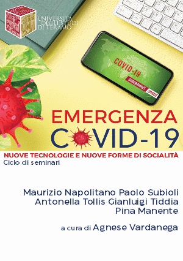

```{r setup, include=FALSE}
options(width = 45)

knitr::opts_chunk$set(prompt=F, comment = "",
                      message = F, warning = F, 
                      collapse = T, echo = F,
                      fig.align = 'center', dpi = 300
                      )

knitr::opts_knit$set(global.par = TRUE)
```

```{r include=FALSE}
library(extrafont)
# automatically create a bib database for R packages
knitr::write_bib(c(
  .packages(), 'bookdown', 'knitr', 'rmarkdown'
  ), 
  'packages.bib')
```

<figure>



</figure>

Webinar di studio svolti fra aprile e maggio 2020 nell'ambito del corso di *Sociologia e ricerca sociale applicata*, Università degli Studi di Teramo, Facoltà di Scienze Politiche.

<br /><br /><br />

<figure>

<a href="https://creativecommons.org/licenses/by-nc-sa/4.0/deed.it" title="Licenza"></a>

</figure>

[La **licenza** [CC BY-NC-SA 4.0](https://creativecommons.org/licenses/by-nc-sa/4.0/deed.it "creative commons") vale per il libro nella sua interezza, che non può dunque essere modificato e/o messo in vendita, in tutto o in parte. I capitoli sono proprietà degli autori. I testi possono essere citati, e le informazioni in essi contenute riutilizzate, citando autore e volume.]{style="font-size:smaller;"}

[L'**immagine di copertina** è la locandina dell'evento, realizzata dalla dr.ssa Lucia Fiore, dell'[Ufficio stampa e produzioni radiotelevisive](https://www.unite.it/UniTE/Ufficio_stampa_e_produzioni_radiotelevisive "UniTe") dell'Università di Teramo.]{style="font-size:smaller;"}

[Il [**logo**](https://www.unite.it/UniTE/Il_Logo "logo UniTe") è proprietà dell'Università degli Studi di Teramo.]{style="font-size:smaller;"}

[**Privacy** queste pagine non fanno uso di cookies e non raccolgono dati di navigazione]{style="font-size:smaller;"}

<!-- \mainmatter -->
